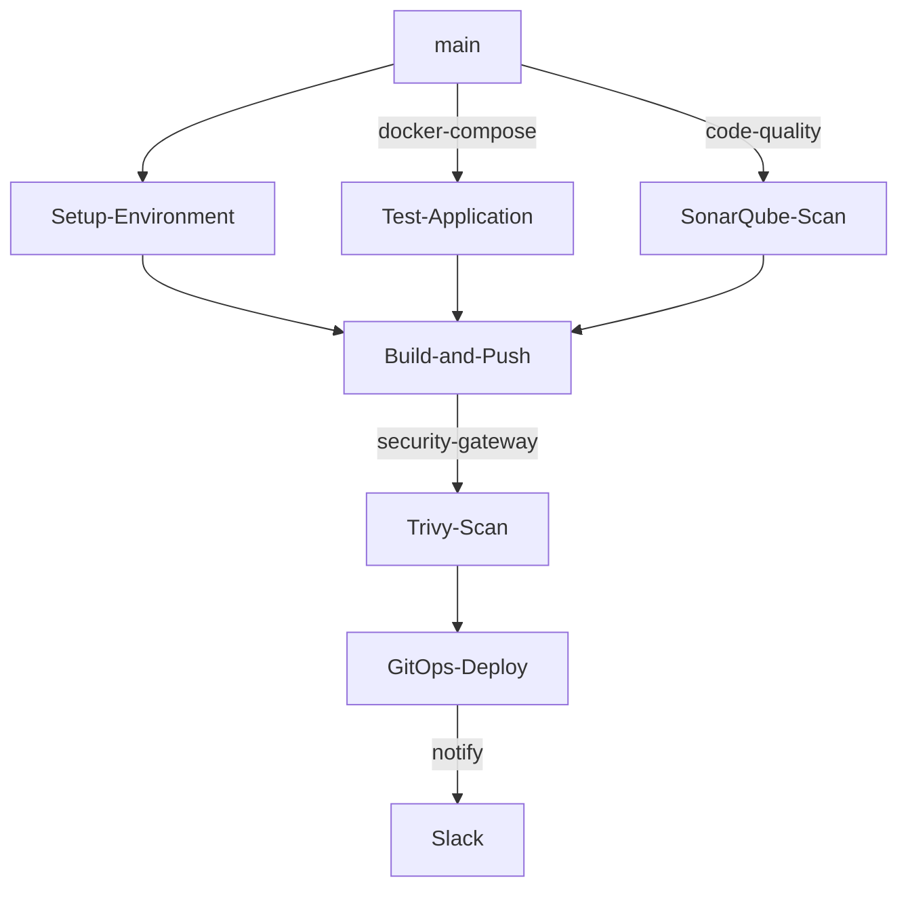

# .github
## GitHub Template Repo

This repository store the DevXP-Tech workflow templates.
## 🚦 Pipeline Workflow

## feature tests 
## release build-and-push, deploy
## hotfix tests , build-and-push, deploy
## main promote
